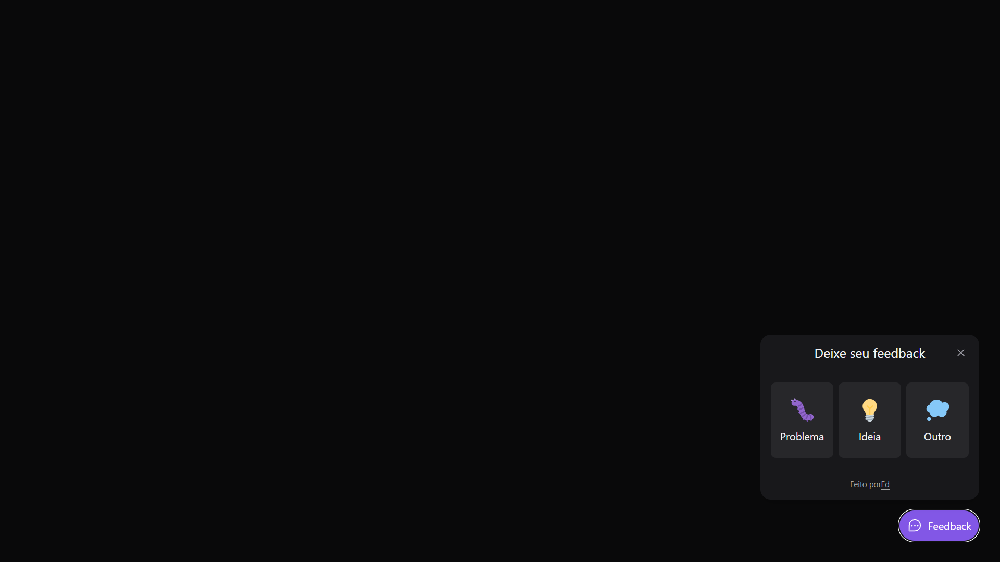
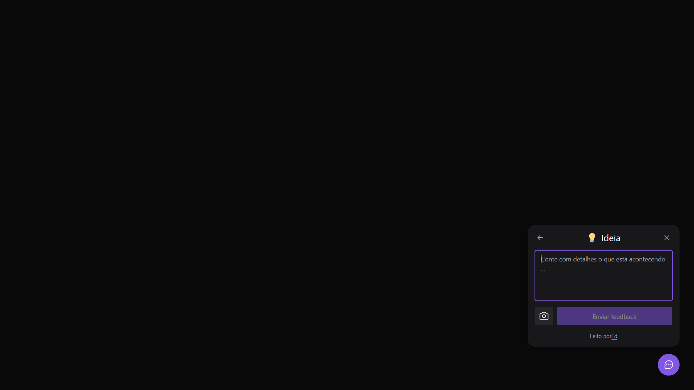
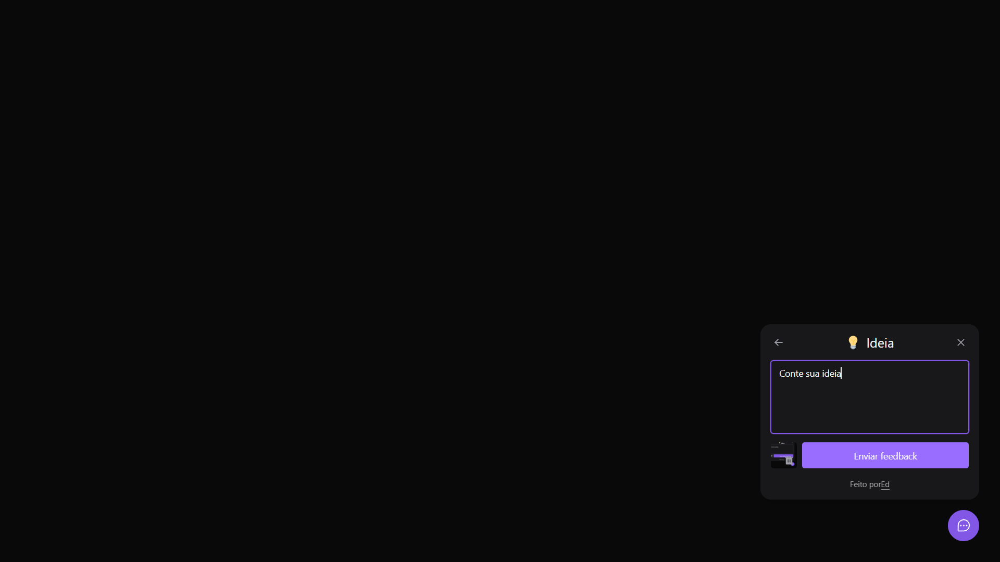

# Feedback Widget React

# Imagens do projeto

  
  
  

# Sobre este  projeto
A ideia do App é:

"Apenas um widget que fica no canto inferior da tela, para ser passado algum feedback, seja bug ou ideia."

# Algumas informações sobre esta API

1 - Não possui um backend para tratar melhor os dados.

# Funcionalidades

* Enviar um feedback.
* Tirar um print da tela e armazena a imagem.

# Construido com:
* React - Para construir a interface e uso de suas funcionalidades.
* Typescript - Foi utilizado por ser uma versão tipada do javascript, o que ajuda na hora de receber dados, evitando receber dados invalidos. Além de ser melhor na hora de realizar manutenção e na construção do sistema é bem mais prático e evita erros.
* Vitejs - Vem utilizando há um certo tempo e super notório o uso desse webpack faz, ele é muito mais rápido e funcional, o que ajuda muito quando precisa reiniciar ou iniciar a aplicação, além de sua perfomasse.
* Tailwind - Para estilizar o projeto.
* @headlessui/react - Usado para acessibilidade do projeto, foi meu primeiro contato e gostei muito e achei muito funcional e algo importante, em breve pretendo ir mais a fundo sobre esse tópico.
* html2canvas - Utilizado para realizar o screenshot
* phosphor-react - Icones para estilização do layout
* Eslint e Prettier - Para manter um código limpo
